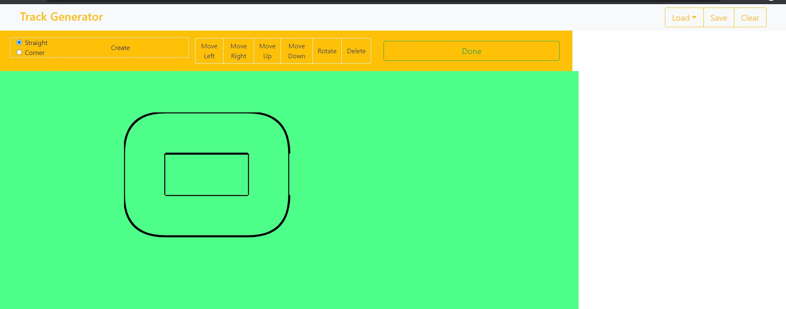

# PistAngular

### A nice tool to create simple draws with dynamic angular components

## Launch

`npm install`
to install all dependencies

` npm run` server to launch [typicode json server](https://github.com/typicode/json-server)

`npm start` to launch angular development server

### and the then go to http://localhost:4200/
